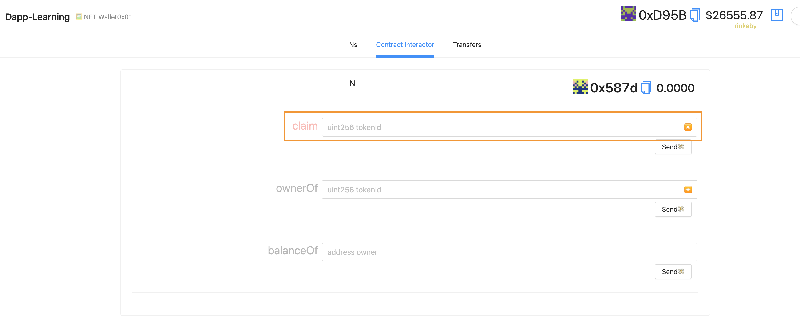

# Dapp-Learning-MOH
我们鼓励开发者对 Dapp-Learning 项目提供更多的代码贡献, 同时对于已经贡献 PR 及后续贡献 PR 的开发者, 作为奖励 Dapp-Learning 项目组发放荣誉勋章 ( NFT )  给 PR 贡献者.   
Dapp-Learning-MOH 项目旨在提供发放 Dapp-Learning 的荣誉勋章的功能模版, 社区开发者可以根据此模版进行修改升级, 以实现符合自身业务的功能需求. 

## 操作步骤  
- 安装 elixir  
以 macos 为例, 其他操作系统可参考 [elixir 官网](https://elixir-lang.org/install.html#macos)
```
brew install elixir
```

- 修改部署网络  
1. 默认合约是部署在测试网络, 如果需要部署在其他网络, 需要修改合约部署脚本.  
如下, 在 hardhat.config.js 文件中有如下配置, 修改 "defaultNetwork" 的网络值就可以指定合约所要部署的网络 
```
const defaultNetwork = "rinkeby";
```

2. 前端启动时, 也会检查 metamask 钱包所选择的网路是否和合约部署网络对应.如果修改了默认的合约部署网路, 对应在 react-app/src/App.jsx 文件中, 也需要进行相应的修改, 具体需要修改的代码如下.  
```
const targetNetwork = NETWORKS.rinkeby;
```

- 配置私钥和 INFURA_ID  
在部署合约之前, 需要进行如下配置下
```shell
## 进入 hardhat 目录
cd hardhat

## 复制 .env.example 文件为 .env
cp .env.example .env

## 在 .env 文件中配置 INFURA_ID 和 PRIVATE_KEY
## 其中 PRIVATE_KEY 可以从 metaMask 中获取, 同时需要保证私钥对应账户有充足的 ETH 
## INFURA_ID 需要登陆 INFURA 账号进行获取

PRIVATE_KEY=xxxxxxxxxxxxxxxx  
INFURA_ID=yyyyyyyy
```  

- 安装依赖   
```shell
## 进入到 jolycao-MOH 根目录
cd jolycao-MOH

## 执行 yarn 安装相应的依赖  
yarn
```

- 合约部署  
执行如下命令, 进行合约部署  
```
yarn deploy
```

- 替换合约地址   
MOH 合约为可升级合约, 所以我们不能直接和 MOH 合约进行交互, 需要和代理合约进行交互. 这里, 修改 MOH 合约地址为代理合约地址  
```
yarn replace
```

- 启动前端  
执行如下命令启动前端  
```
yarn start
```

- Mint NFT  
前端界面上选择 "Contract Interactor", 然后在 claim 中输入 NFT id , 之后点击 "Send" 

